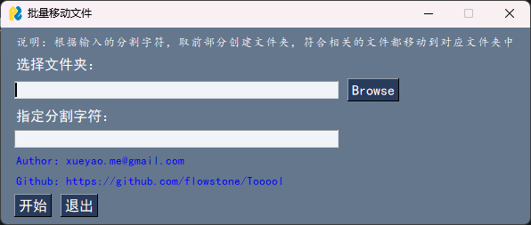

# Tooool
自用的小工具

目前采用PySimpleGUI开发

1. 测试脚本 
``` bash
python 脚本.py
```
2. 打包脚本
``` bash
pyinstaller -F -w 脚本.py
```

#### BatchFileRenamer 

支持批量修改文件名，前缀、后缀、替换操作


#### BatchCreateFolderSlice

指定文件夹下，根据分割符匹配文件名，前部分创建文件夹并把符合的文件都移动到对应的文件夹下


